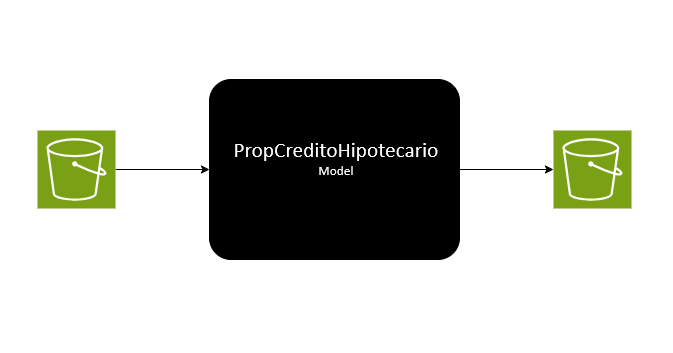

## Desafío técnico MLOps

> [!IMPORTANT]
A continuación encontrará una serie de ejercicios diseñados para evaluar su aptitud técnica para resolver problemas complejos. <b>Ningún ejercicio es eliminatorio</b>. La interpretación de cada ejercicio y las soluciones propuestas se usan para calibrar su experiencia. Procure demostrar su stack tecnológico cada vez que pueda. Si algún ejercicio en particular le da problemas, responda coloquialmente o con pseudocódigo cómo lo resolvería. Puede asumir cualquier escenario o dato que le parezca pertinente cada vez que la información provista le resulte insuficiente. 

## 1 - Entrenamiento auditable

Un colega acaba de finalizar un proyecto en el que lleva trabajando meses. Se trata de un modelo que permite a los tasadores obtener un precio estimado para las propiedades que visitan en el marco de una solicitud de crédito hipotecario. Aunque el modelo no arroja el valor de tasación final, permite definir rápidamente si la propiedad está a un precio razonable para avalar inmediatamente la solicitud. Esto reduce los tiempos de gestión del proceso un 20% (dado que permite comenzar con dichas tareas incluso antes de tener la tasación definitva), y acelera el tiempo de rechazo de solicitudes indeseadas, disminuyendo significativamente el costo de backoffice. 

Está muy contento con el resultado pero, confiesa, le aterra la posiblidad de tener que hacer esto desde cero si algo pasara con el modelo. Por eso, solicita su asistencia para mejorar su trabajo y convertirlo su script de entrenamiento en un proceso reproducible, auditable y, en la medida de lo posible, reutilizable para otros problemas similares. También quisiera poder comparar ágilmente todos los modelos producidos durante una corrida de entrenamiento, y entre distitnas corridas (posteriores) para poder tomar mejores decisiones. Su colega le provee de un dataset de refeencia (`./model/data/housing.csv`), un script de entrenamiento (`./model/train.py`) y uno de inferencia (`./model/inference.py`). También comenta que usó Python 3.10, pandas 2.3.0, numpy 2.2.6, joblib 1.5.1 y scikit-learn 1.7.0.

Convierta estos humildes recursos en un entrenamiento reproducible, auditable y comparable con otros mediante el uso de cualquier herramienta que conozca para tal fin y que pueda desplegar en un ambiente local. Realice todas las modificaciones que considere necesarias en el `train.py` para adaptarlo a las herramientas o paradigma de trabajo que haya elegido. 

## 2 - ML en Producción

### Segunda parte (API)

¡El modelo fue un éxito! Ahora, otro colega le solicita ayuda para desarrollar una API que permita a los tasadores hacer estimaciones de precio a demanda. Dado que el modelo solo se usa durante la visita del tasador, el mismo solo debe estar disponible entre las 09:00 y 18:00 hs. Su colega, un trainee Machine Learning Engineer, ha adelantado algo del código de la API (`./api`) viendo un tutorial de youtube, pero realmente precisa acompañamiento para hacerlo andar. El microservicio se integrará con un aplicativo existente, por lo que no es necesario generar un frontend para el mismo. No obstante, sí es necesario que la API esté apta para comunicarse de forma estandarizada con otros sistemas.

1. Diagnostique el/los errores que aparecen al intentar correr la API (`uvicorn main:app --host 0.0.0.0 --port 8000`)
2. Corrija los errores y realice las mejoras que considere pertinentes.
3. Compruebe el correcto funcionamiento de la API
4. Pusheee los cambios al repositorio

>[!NOTE]
Incorpore al repositorio todo lo que considere necesario para llevar la API a, según su criterio, los estándares mínimos de una REST API en producción. 

### Segunda parte (Batch)

El modelo que sus colegas ha desarrollado y al cual usted ha contribuído es un éxito ¡Las solicitudes de créditos hipotecarios se cuentan de a decenas por día! Desde el negocio estiman que una campaña de marketing dirigido podría quintuplicar este número. Detrás de ese lead, el equipo de Análitica Avanzada desarrolló un modelo de propensión  a la adquisición de este producto (`propCreditoHipotecario`). La idea de implementación propone contactar activamente a los clientes con mayor propensión a aplicar para un crédito hipotecario, pero el contact-center tiene capacidad para contactar solo a 10000 por mes. Adems, dado que la propensión podría variar sensiblemente mes a mes, el modelo deberá ejecutarse una vez por mes contra toda la base de clientes del banco (~4M). Todos los datos necesarios para el funcionamiento del modelo pueden obtenerse de S3 desde un archivo `.csv` (~1.1 GB). Las predicciones éste produzca deberán disponibilizarse también vía S3 (~0.1 GB) mediante la escritura de un archivo (también `.csv`), tal cual describe el esquema a continuación:

Proponga una arquitectura de solución para la caja negra que tenga en consideración las necesidades del enunciado. Puede hacerlo en forma coloquial o de diagrama de flujo. Considere, además, los siguientes escenarios para disctuir durante la entrevista:

- A los 6 meses de puesto en producción, el área de seguros reporta que las predicciones no son acertadas. Ya prácticamente ninguno de los casi 10000 contactos resultan en conversiones ¿Qué cree que podría estar pasando?¿Cómo podría haberlo anticipado?¿Cómo lo solucionaría?
- Junto a este modelo, otra decena de soluciones similares se incorporaron al catálogo. El tiempo de delivery es cada vez más crítico ¿Qué parte de la arquitectura de su solución cree que podría automatizarse e integrarse a un flujo de CI/CD?
- Como política de mejora continua, un gerente decide reemplazar cada 3 meses sus modelos productivos por otros entrenados con datos actualizados. Sin excepción. ¿Cómo garantizaría que un modelo recientemente entrenado no performe peor que el anterior? ¿Qué recaudos tomaría?

### Tercera parte (EXTRA)

El boom de consultas por créditos hipotecarios est **TOTAL**. Las oficinas comerciales y el onboarding digital de clientes no dan abasto. Al científico de datos a cargo del proyecto se le ocurre que "Consultó por Crédito Hipotecario: 0/1" es una *feature* que tenemos que aprovechar para mejorar el modelo de propensión. No obstante, el banco lleva tanto tiempo sin ofrecerlos que "Crédito Hipotecario" no es una tipificación posible para clasificar el motivo de consulta en el CRM actual. Los agentes del contact y asesores comerciales tipifican estas interacciones como "Consulta Créditos" y, tanto la llamada (grabación y metadatos) como su tipificación, están disponibles en el data lake. Las pruebas preliminares incorporando esa tipificación como feature empeoran la especificidad del modelo, dado que solo 1 de cada 100 consultas por créditos son acerca de hipotecarios. La feature debe reflejar única y exclusivamente las consultas sobre créditos hipotecarios. 

Proponga/esquematice una solución que permita re-clasificar todas las interacciones en donde se solicita información sobre créditos hipotecarios e incorporar esta información al modelo de propensión del escenario anterior. 